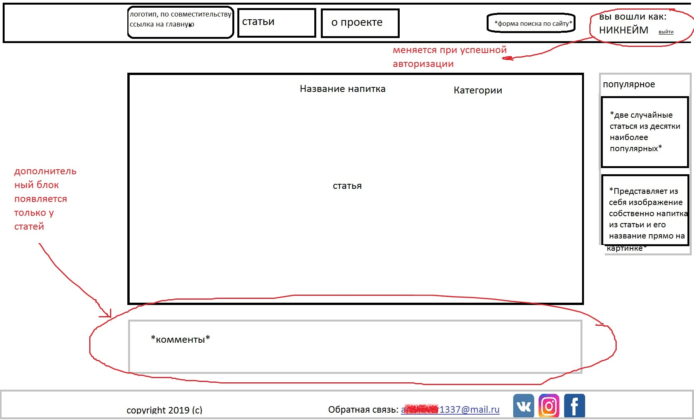

### Техническое задание

## Состав команды

* Дуев Михаил
* Ермолаев Владислав
* Суетов Денис
* Щепетов Александр

## Предмет разработки
Предметом разработки является информационный портал, целью которого является предоставление пользователям информации об алкогольных и безалкогольных коктейлях и возможности обсуждения и поиска конкретных статей.
В дальнейшем планируется монитизировать сайт с помощью встроенной рекламы.

## Функции сайта
Основными функциями сайта являются:

* Возможность поиска статей о разнообразных алкогольных и безалкогольных коктейлях для всех пользователей
* Функция поиска рецептов коктейлей с возможнностью фильтрации по конкретным ингридиентам для всех пользователей
* Функция регистрации и авторизации на сайте
* Возможность добавлять, оценивать и комментировать статьи для авторизованных пользователей

## Модель данных

**Коктейль**

* Название (текст)
* Крепость (число)
* Ингридиенты (M:M)
* Статья (1:1)
* Категория (текст)

**Ингридиент**

* Продукт (текст)
* Количество (число)

**Продукт**

* Название (текст)
* Единица измерения (текст)

**Статья**

* Содержание статьи (1:1)
* Комментарии (1:M)
* Рейтинг (число)

**Содержание статьи**

* Текст статьи (текст)
* Изображения (файл)
* Ссылки (гипертекст)

**Пользователи**

* Логин (текст)
* Пароль (текст)
* E-mail (текст)
* Никнейм (текст)

**Комментарий**

* Никнейм (1:M)
* Текст комментария (текст)

## Список страниц

* Главная (калькулятор)
* Вход
* Регистрация
* Список статей
* Отдельная статья
* "О проекте" (информация о проекте)
* Результат совпадения (вывод калькулятора)
* Instagram

## Макет страниц сайта

**Основной шаблон**

**Главная страница**

**Результаты поиска**

**Статья**

