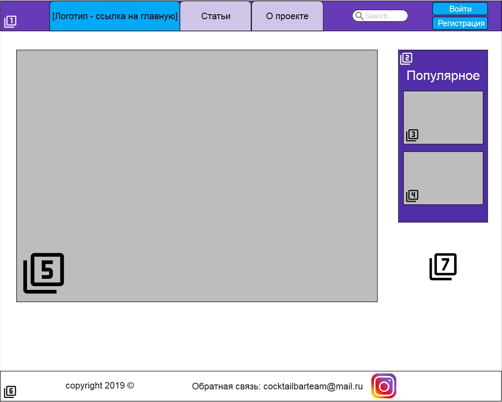
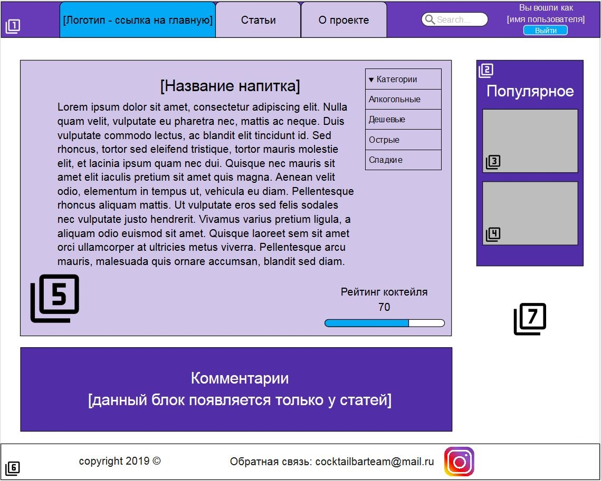

### Техническое задание

## Состав команды

* Дуев Михаил
* Ермолаев Владислав
* Суетов Денис
* Щепетов Александр

## Предмет разработки
Предметом разработки является информационный портал, целью которого является предоставление пользователям информации об алкогольных и безалкогольных коктейлях и возможности обсуждения и поиска конкретных статей.
В дальнейшем планируется монитизировать сайт с помощью встроенной рекламы.

## Функции сайта
Основными функциями сайта являются:

* Возможность поиска статей о разнообразных алкогольных и безалкогольных коктейлях для всех пользователей
* Функция поиска рецептов коктейлей с возможнностью фильтрации по конкретным ингридиентам для всех пользователей
* Функция регистрации и авторизации на сайте
* Возможность добавлять, оценивать и комментировать статьи для авторизованных пользователей

## Модель данных

**Пользователь**

* E-mail (текст)
* Логин (текст)
* Пароль (текст)
* Имя (текст)
* Фамилия (текст)
* Никнейм (текст)
* Дата рождения (date)
* Пол(логический)
* Место проживания(текст)

**Комментарий**

* Статья
* Пользователь
* Текст комментария (текст)
* Дата/время (datetime)

**Статья**

* Коктейль
* Рейтинг (число)

**Содержание статьи**

* Статья
* Текст статьи (текст)
* Изображения (графический файл)
* Ссылки (гипертекст)

**Коктейль**

* Название (текст)
* Крепость (число)
* Категория (текст)

**Набор ингредиентов**

* Коктейль

**Ингредиент**

* Набор ингридиентов
* Количество (число)

**Продукт**

* Ингредиент
* Название (текст)
* Единица измерения (текст)

**Статья**

* Коктейль
* Рейтинг (число)

**Набор изображений**

* Статья

**Изображение**

* Набор изображений
* Изображение (графический файл)

**Поиск**

* Статья

## Список страниц

* Главная (калькулятор)
* Вход
* Регистрация
* Список статей
* Отдельная статья
* "О проекте" (информация о проекте)
* Результат совпадения (вывод калькулятора)
* Страница с безуспешным результатом поиска

## Описание форм

**Форма входа. Находиться на странице входа на сайт после нажатия на блок "логин".**

* Логин (text)
* Пароль (text)
* Войти (submit)

**Форма регистрации. Находиться на странице регистрации после нажатия на блок "регистрация".**

* Email(обязательно к заполнению) (text)
* Пароль(обязательно к заполнению) (text)
* Имя (text)
* Фамилия (text)
* Никнейм (обязательно к заполнению) (text)
* Дата рождения (обязательно к заполнению) (date)
* Пол (обязательно к заполнению) (radio)
* Место проживания (text)
* Зарегистрироваться (submit)

**Форма подбора коктейля. Находиться на главной странице.**

* Крепкоалкогольные напитки (select)
* Среднеалкогольные напитки (select)
* Слабоалкогольные напитки (select)
* Безалкогольные напитки (select)
* Продукты (select)
* Создать коктейль (submit)

**Форма отправки комментария. Находится на странице "Статья" под блоком "Комментарии".**

* Поле ввода комментария (text)
* Отправить комментарий (submit)

**Форма оценки коктейля. Находится на странице "Статья" под блоком "Рейтинг статьи".**

* Положительная оценка. Скрытое поле. checked="checked" (checkbox)
* Отрицательная оценка. Скрытое поле. checked="checked" (checkbox)
* Отправить положительную оценку (submit)
* Отправить негативную оценку (submit)

**Форма поиска по сайту. Находится на всех страницах в шапке сайта после блока "О проекте".**

* Текст для поиска (text)
* Поиск (submit)

## Сценарии на сайте

* Сценарий регистрации. Добавляет новую запись в таблицу "Пользователи" в БД с соответсвующими данными, если заполненная и успешно отправленная пользователем форма регистрации корректна. Некорректной считается та, в которой поля "никнейм" или "e-mail" повторяет содержащиеся в уже существующих записях из таблицы "Пользователь". В ином случае возвращает страницу регистрации поля формы на которой уже содержат данные, которые пользователь ввел корректно и сообщение о допущенной пользователем ошибки. 
* Авторизация. Если поля переданной пользователем формы авторизации соответсуют существующей записи в таблице "Пользователи", сессия получает пометку авторизованного пользователя. 
* Добавление комментария. Извлекает данные из переданной непустой формы, создает новую запись в таблице "Комментарий" в БД, связывает ее с записью в таблице "Наборы комментариев", связанной со статьей, к которому добавлялся комментарий. Возвращает ту же страницу. Если пользователь неавторизован, вместо этого перенаправляет на страницу авторизации.
* Оценка статьи. Извлекает данные из отправленной пользователем формы оценки. В зависимости от выбранной им оценки (+/-) повышает/понижает значение поля "Рейтинг" соответствующей статьи на единицу. Если пользователь неавторизован, вместо этого перенаправляет на страницу авторизации.
* Сценарий, который при каждом переходе внутри сайта выбирающий две случайные статьи из десяти обладающих наибольшим рейтингом и передающий ссылки на них и изображения из их шапки загружаемой странице для размещения в специальном блоке, расположенном с правого края страницы.
* Подбор коктейля - принимает соответствующую форму, обращается к БД, выбирает записи из таблицы "Наборы ингредиентов", к которым относятся записи в таблице "Ингредиенты", с которыми связаны записи из "Продукты", поле "Наименование" которых совпадает хотя бы с одним полем формы, переданной пользователем, добавляет их в список. Передает непустой список шаблону страницы "Результаты поиска", в которой для каждой извлеченной записи "Набор ингредиентов" размещается блок, содержащий гиперссылку на коктейль (текст ссылки - его название), с которым связана таблица и отсортированный список, состоящий из названий продуктов, связанных через записи "Ингредиент" с ней, в котором имеют зеленый цвет и идут первыми те названия продуктов, которые содержались в отправленной пользователем форме. Возвращает пользователю сгенерированную страницу. Если список не содержит ни одной записи "Набор ингредиетов", возвращает пользователю страницу подобора коктейля, с сообщением о том, что не найдено ни одного коктейля.
* Сортировка результатов поиска по коктейлю. Производится через обращение к БД для оценки атрибута, по которому производится сортировка и дальнейшей сортировки списка уже выбранных записей по этому атрибуту.
* Поиск по сайту. Принимает непустую форму, обращается к БД, ищет среди "Коктейль" запись, поле "Название коктейля" которой повторяет (без учета регистра) содержание поля "Текст для поиска" отправленной пользователем формы. Возвращает страницу статьи соответствующего коктейля, если совпадение найдено, если нет - возвращает пользователя на ту же страницу, с которой он производил поиск, также содержащую сообщение о том, что ничего не найдено.

## Макет страниц сайта

**Пояснения**

1. Header. Закреплен на верху страницы.
2. Блок "Популярное".
3. Ссылка на случайную статью из десятки наиболее популярных. Представляет собой обложку статьи о коктейле с наложенным на него его названием.
4. См. пункт 3.
5. Основной блок, единственное, что меняется при переходе между страницами сайта.
6. Footer. Содержит email для обратной связи и ссылки на социальные сети.
7. Background.

**Основной шаблон**

**Главная страница**

**Результаты поиска**

**Статья**

**Регистрация**

**О проекте**

